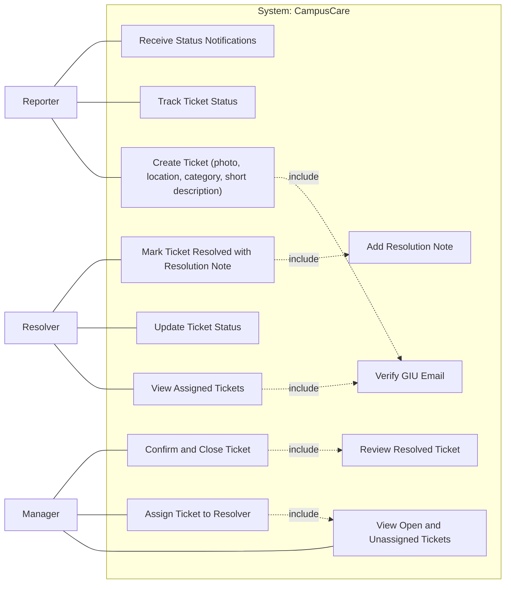

1. Introduction 
This Software Requirements Specification (SRS) defines the requirements for CampusCare, a mobile facility management application for the GIU community. The system enables students and staff to report infrastructure, maintenance, sustainability, and cleanliness issues (for example, broken doors, flickering lights, open windows while AC is running, and overflowing trash cans) through a formal digital process. It also enables the Facility Management team to receive issues, assign personnel, track progress, and update status in a closed loop visible to relevant users. The intended audience includes the project team, teaching staff, and stakeholders, and this document will evolve as requirements are refined.

1.1 Product Vision & Scope
CampusCare aims to provide a simple and fast way for GIU community members to report campus facility issues and follow resolution progress. The Milestone 1 scope focuses on three operational roles: Reporter, Manager, and Resolver. A Reporter can create a ticket with a photo, short description, category, and location, then track status updates. A Manager can review open tickets, assign them to resolvers, and perform final confirmation and closure after work is marked as resolved. A Resolver can view assigned tickets, update status, and submit a resolution note when work is done. Authentication allows only GIU email accounts and requires email verification before full access for Reporter and Resolver roles. Manager access is provisioned through preconfigured accounts. The product goal is low friction reporting with clear and intuitive user experience.

1.2 Definitions and Acronyms
SRS: Software Requirements Specification
MVP: Minimum Viable Product
GIU: German International University
Ticket: A digital record of a reported campus issue
Reporter: A GIU community member who submits and tracks tickets
Manager: A facility management role that assigns tickets, reviews completed work, and performs final closure
Resolver: A facility team member who handles assigned tickets and updates status
Authentication: Process of confirming user identity before access
Email Verification: Confirmation that the user controls a valid GIU email address
FR: Functional Requirement
NFR: Non Functional Requirement
UML: Unified Modeling Language

2. Functional Requirements
Describes what the system should do, first in the form of user stories then as a list of functional requirements for each user/role. A UML use-case diagrams should then be included to link specific features and requirements. 

2.1 User stories:
These user stories are a working baseline and may be refined during development as requirements become clearer.
As a Reporter, I want to submit a ticket with photo, location, category, and short description, so that facility issues are reported quickly.
As a Reporter, I want to track ticket status updates, so that I know what is happening after submission.
As a Reporter, I want to receive notifications on key status changes, so that I do not need to check manually.
As a Manager, I want to view open and unassigned tickets, so that I can prioritize work.
As a Manager, I want to assign tickets to resolvers, so ownership is clear.
As a Manager, I want to confirm completed work and close tickets, so closure is controlled and accurate.
As a Resolver, I want to view only tickets assigned to me, so that I can focus on my queue.
As a Resolver, I want to update ticket status while working, so that progress is visible to reporters and managers.
As a Resolver, I want to mark a ticket as resolved with a resolution note, so it can be reviewed by the manager for final closure.

2.1.1 Functional Requirements
These functional requirements are derived from the user stories above and may be refined during development.

User: Reporter
FR-01 (Create Ticket): The system shall allow a verified Reporter to create a ticket with photo, location, category, and short description.
FR-02 (Track Ticket Status): The system shall allow a Reporter to view the current status and status history of tickets submitted by that Reporter.
FR-03 (Status Notifications): The system shall notify a Reporter when the status of one of their submitted tickets changes.

User: Manager
FR-04 (View Unassigned Tickets): The system shall allow a Manager to view open and unassigned tickets.
FR-05 (Assign Ticket): The system shall allow a Manager to assign an open ticket to a Resolver.
FR-06 (Confirm and Close): The system shall allow a Manager to review resolved tickets and set final status to closed.
FR-07 (Manager Provisioning): The Manager account shall be preconfigured and is not created through in app onboarding.

User: Resolver
FR-08 (View Assigned Tickets): The system shall allow a Resolver to view only tickets assigned to that Resolver.
FR-09 (Update Status): The system shall allow a Resolver to update ticket status during handling.
FR-10 (Mark Resolved): The system shall allow a Resolver to mark a ticket as resolved only when a resolution note is provided.

2.2 UML Use-case Diagram
The UML use-case diagram models CampusCare with three external actors: Reporter, Manager, and Resolver.
- Reporter is associated with: Create Ticket (photo, location, category, short description), Track Ticket Status, and Receive Status Notifications.
- Manager is associated with: View Open and Unassigned Tickets, Assign Ticket to Resolver, and Confirm and Close Ticket.
- Resolver is associated with: View Assigned Tickets, Update Ticket Status, and Mark Ticket Resolved with Resolution Note.
- Include relationships shown in the diagram:
  - Create Ticket includes Verify GIU Email.
  - View Assigned Tickets includes Verify GIU Email.
  - Mark Ticket Resolved with Resolution Note includes Add Resolution Note.
  - Confirm and Close Ticket includes Review Resolved Ticket.
  - Manager use cases do not include Verify GIU Email.
- System boundary: all use cases are inside the system "CampusCare" boundary, with actors outside.

Mermaid draft:

3. Non-functional Requirements:
NFR-01 Usability: A Reporter should be able to submit a ticket in under 1 minute.
NFR-02 Performance: Main screens should load in under 3 seconds on normal network conditions.
NFR-03 Reliability: Failed submissions should be handled gracefully, and users should be able to retry without losing entered data.
NFR-04 Security: Only verified GIU email accounts can access the app.
NFR-05 Access Control: Reporter, Manager, and Resolver permissions must be enforced.
NFR-06 Availability: The service should be generally always…
NFR-07 Maintainability: The codebase should be modular and easy to update during the semester.

4. Constraints
Manager accounts are preconfigured for Milestone 1 and are not created through in app onboarding.
Manager performs the final close action after resolver marks a ticket as resolved.

5. Entity Relation Diagram
This could and probably will change during the actual development of the app.
The ERD currently contains three entities and their relationships:

Entity: USER
- user_id (string, PK)
- email (string)
- full_name (string)
- role (string)
- email_verified (boolean)
- created_at (datetime)

Entity: TICKET
- ticket_id (string, PK)
- reporter_id (string, FK -> USER.user_id)
- manager_id (string, FK -> USER.user_id)
- resolver_id (string, FK -> USER.user_id)
- category (string)
- description (string)
- location (string)
- image_storage_id (string)
- status (string)
- resolution_note (string)
- created_at (datetime)
- claimed_at (datetime)
- updated_at (datetime)
- closed_at (datetime)

Entity: TICKET_STATUS_HISTORY
- history_id (string, PK)
- ticket_id (string, FK -> TICKET.ticket_id)
- changed_by (string, FK -> USER.user_id)
- from_status (string)
- to_status (string)
- note (string)
- changed_at (datetime)

Relationships represented:
- One USER (as Reporter) can create many TICKET records via reporter_id.
- One USER (as Manager) can assign many TICKET records via manager_id.
- One USER (as Resolver) can be assigned to many TICKET records via resolver_id.
- One TICKET can have many TICKET_STATUS_HISTORY entries.
- One USER can create many TICKET_STATUS_HISTORY entries via changed_by.

Schema note:
- Detailed database schema implementation is intentionally deferred for now and is not added in this context document.

6. Technology Stack
•   Backend and Database: Convex
•   React native
•   File Storage: Convex File Storage will be used to store ticket images
•   Response Time: Page load times under three seconds
•   Concurrent Users: Support for at least 500 simultaneous users
•   API Security: Rate limiting and input validation

7. Future Scope of the Project
•   Gamification features such as points, badges, or participation streaks to encourage issue reporting and community engagement.
•   Configurable deployment template so the platform can be adapted for environments beyond universities including office campuses, residential compounds, and public facilities… maybe using ai and sdui do avoid strictness in requirements such as has to have “building” or “floor” etc..
