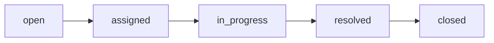

# CampusCare API Documentation

CampusCare uses Convex functions as its API surface. Client code calls these functions through the generated Convex API object from `convex/_generated/api`.

## API Conventions

- All protected functions require a Clerk-authenticated Convex identity.
- Protected app access requires a verified GIU email ending in `giu-uni.de` or a subdomain such as `student.giu-uni.de`.
- Manager access is controlled by the Convex `MANAGER_EMAIL_ALLOWLIST` environment variable.
- Public Convex queries and mutations still enforce authorization inside the handler.
- Paginated list functions use Convex `paginationOpts` and return Convex pagination results.
- `Id<"table">` values are Convex document ids, not raw database strings.
- Timestamps are stored as Unix epoch milliseconds.

## Domain Values

### User Roles

| Value | Meaning |
| --- | --- |
| `reporter` | Can submit and track own tickets. |
| `resolver` | Can submit tickets and work assigned tickets. |
| `manager` | Can assign resolvers, manage resolver access, monitor tickets, and close resolved tickets. |

### Account Statuses

| Value | Meaning |
| --- | --- |
| `active` | User can access role workflows. |
| `pending_resolver_approval` | Resolver request is waiting for manager approval. |
| `resolver_rejected` | Resolver request was rejected. |
| `inactive` | Manager-deactivated account. |

### Ticket Statuses

Allowed status path:

| Value | Meaning |
| --- | --- |
| `open` | Reporter submitted the ticket; no resolver assigned yet. |
| `assigned` | Manager assigned an active resolver. |
| `in_progress` | Resolver started work. |
| `resolved` | Resolver marked work complete with a resolution note. |
| `closed` | Manager reviewed and closed the ticket. |

## Shared Response Shapes

### Access Summary

Returned by `auth.upsertCurrentUser` and `auth.getMyAccess`.

| Field | Type |
| --- | --- |
| `userId` | `Id<"users">` |
| `email` | `string` |
| `fullName` | `string` |
| `role` | `reporter | resolver | manager` |
| `accountStatus` | `active | pending_resolver_approval | resolver_rejected | inactive` |
| `latestResolverRequestId` | `Id<"resolver_requests"> | null` |
| `latestResolverRequestStatus` | `pending | approved | rejected | null` |
| `latestResolverDecisionNote` | `string | null` |

### Ticket With Image URL

Used by ticket list endpoints.

| Field | Type |
| --- | --- |
| `_id` | `Id<"tickets">` |
| `_creationTime` | `number` |
| `reporterUserId` | `Id<"users">` |
| `managerUserId` | `Id<"users"> | null` |
| `resolverUserId` | `Id<"users"> | null` |
| `category` | `string` |
| `description` | `string` |
| `location` | `string` |
| `imageStorageId` | `Id<"_storage">` |
| `imageUrl` | `string | null` |
| `resolutionImageStorageId` | `Id<"_storage"> | null` |
| `resolutionImageUrl` | `string | null` |
| `status` | Ticket status |
| `resolutionNote` | `string | null` |
| `createdAt` | `number` |
| `updatedAt` | `number` |
| `resolvedAt` | `number | null` |
| `closedAt` | `number | null` |

## Authentication API

### `auth.upsertCurrentUser`

Mutation. Creates or updates the current user profile after Clerk sign-in.

| Property | Details |
| --- | --- |
| Role access | Verified GIU email required. |
| Args | `{ intent: "reporter" | "resolver" }` |
| Returns | Access Summary |
| Notes | Allowlisted manager emails become managers. Resolver intent creates or preserves a pending resolver request when needed. |

### `auth.getMyAccess`

Query. Reads the current user's app access state.

| Property | Details |
| --- | --- |
| Role access | Authenticated identity with verified GIU email. Returns `null` if unauthenticated, unverified, non-GIU, or not onboarded. |
| Args | `{}` |
| Returns | `Access Summary | null` |

## Reporter API

### `ticketsReporter.generateUploadUrl`

Mutation. Creates a Convex File Storage upload URL.

| Property | Details |
| --- | --- |
| Role access | Active `reporter` or `resolver`. |
| Args | `{}` |
| Returns | `string` |

### `ticketsReporter.create`

Mutation. Creates an open ticket from an already uploaded image.

| Property | Details |
| --- | --- |
| Role access | Active `reporter` or `resolver`. |
| Args | `{ category: string, description: string, location: string, imageStorageId: Id<"_storage"> }` |
| Returns | `{ ticketId: Id<"tickets"> }` |
| Validation | Category max 80 chars, location max 140 chars, description max 1200 chars, image max 8 MB. |
| Side effects | Appends initial status history and notifies active managers. |

### `ticketsReporter.deleteUnusedUpload`

Mutation. Deletes an uploaded file if no ticket references it.

| Property | Details |
| --- | --- |
| Role access | Active `reporter` or `resolver`. |
| Args | `{ storageId: Id<"_storage"> }` |
| Returns | `null` |

### `ticketsReporter.listMine`

Query. Lists tickets submitted by the current reporter.

| Property | Details |
| --- | --- |
| Role access | Active `reporter` or `resolver`. |
| Args | `{ paginationOpts }` |
| Returns | Paginated Ticket With Image URL results. |

### `ticketsReporter.getMineById`

Query. Reads one of the current reporter's tickets with status history.

| Property | Details |
| --- | --- |
| Role access | Active `reporter` or `resolver`. |
| Args | `{ ticketId: Id<"tickets"> }` |
| Returns | `{ ticket, history } | null` |

### `usersReporter.myStats`

Query. Reads reporter gamification stats.

| Property | Details |
| --- | --- |
| Role access | Active `reporter` or `resolver`. |
| Args | `{}` |
| Returns | `{ xp: number, level: number, badges: string[], closedTicketsCount: number } | null` |

## Resolver API

### `resolverRequests.create`

Mutation. Requests resolver access.

| Property | Details |
| --- | --- |
| Role access | Verified GIU user with onboarded account. Managers cannot request resolver access. |
| Args | `{ reason?: string }` |
| Returns | `{ requestId: Id<"resolver_requests">, status: "pending" | "approved" | "rejected", wasCreated: boolean }` |
| Side effects | Sets user to `pending_resolver_approval` and notifies managers. |

### `resolverRequests.getMineLatest`

Query. Reads the user's latest resolver request.

| Property | Details |
| --- | --- |
| Role access | Verified GIU user with onboarded account. |
| Args | `{}` |
| Returns | Resolver request document or `null`. |

### `resolverRequests.reapply`

Mutation. Reapplies after a rejected resolver request.

| Property | Details |
| --- | --- |
| Role access | Verified GIU user with rejected resolver request. |
| Args | `{ reason?: string }` |
| Returns | `{ requestId, status, wasCreated }` |

### `ticketsResolver.listAssignedToMe`

Query. Lists tickets assigned to the current resolver.

| Property | Details |
| --- | --- |
| Role access | Active `resolver`. |
| Args | `{ paginationOpts }` |
| Returns | Paginated Ticket With Image URL results. |

### `ticketsResolver.setInProgress`

Mutation. Moves an assigned ticket to `in_progress`.

| Property | Details |
| --- | --- |
| Role access | Active assigned `resolver`. |
| Args | `{ ticketId: Id<"tickets">, note?: string }` |
| Returns | `null` |
| Side effects | Appends status history and notifies the reporter. |

### `ticketsResolver.markResolved`

Mutation. Marks an assigned ticket as resolved.

| Property | Details |
| --- | --- |
| Role access | Active assigned `resolver`. |
| Args | `{ ticketId: Id<"tickets">, resolutionNote: string, resolutionImageStorageId?: Id<"_storage"> }` |
| Returns | `null` |
| Validation | Resolution note is required, max 1200 chars. Optional resolution image max 8 MB. |
| Side effects | Appends status history and notifies reporter and managers. |

## Manager API

### `resolverRequests.listPending`

Query. Lists pending resolver access requests.

| Property | Details |
| --- | --- |
| Role access | Active `manager`. |
| Args | `{ paginationOpts }` |
| Returns | Paginated resolver request documents. |

### `resolverRequests.approve`

Mutation. Approves resolver access.

| Property | Details |
| --- | --- |
| Role access | Active `manager`. |
| Args | `{ requestId: Id<"resolver_requests"> }` |
| Returns | `null` |
| Side effects | Sets requester role to `resolver`, account status to `active`, and notifies requester. |

### `resolverRequests.reject`

Mutation. Rejects resolver access.

| Property | Details |
| --- | --- |
| Role access | Active `manager`. |
| Args | `{ requestId: Id<"resolver_requests">, decisionNote: string }` |
| Returns | `null` |
| Validation | Decision note is required. |

### `ticketsManager.listActiveResolvers`

Query. Lists active resolvers for assignment.

| Property | Details |
| --- | --- |
| Role access | Active `manager`. |
| Args | `{}` |
| Returns | Array of `{ _id, fullName, email }`, capped at 200 users. |

### `ticketsManager.listOpenUnassigned`

Query. Lists open tickets that have not been assigned.

| Property | Details |
| --- | --- |
| Role access | Active `manager`. |
| Args | `{ paginationOpts }` |
| Returns | Paginated Ticket With Image URL results. |

### `ticketsManager.assignResolver`

Mutation. Assigns an active resolver to an open ticket.

| Property | Details |
| --- | --- |
| Role access | Active `manager`. |
| Args | `{ ticketId: Id<"tickets">, resolverUserId: Id<"users">, note?: string }` |
| Returns | `null` |
| Side effects | Sets `managerUserId`, `resolverUserId`, status `assigned`, appends history, and notifies reporter and resolver. |

### `ticketsManager.listResolvedAwaitingClose`

Query. Lists resolved tickets waiting for manager closure.

| Property | Details |
| --- | --- |
| Role access | Active `manager`. |
| Args | `{ paginationOpts }` |
| Returns | Paginated Ticket With Image URL results. |

### `ticketsManager.close`

Mutation. Closes a resolved ticket after manager review.

| Property | Details |
| --- | --- |
| Role access | Active `manager`. |
| Args | `{ ticketId: Id<"tickets">, note?: string }` |
| Returns | `null` |
| Side effects | Sets status `closed`, appends history, notifies reporter and resolver, and awards reporter XP. |

### `ticketsManager.listMonitor`

Query. Lists all tickets for manager monitoring.

| Property | Details |
| --- | --- |
| Role access | Active `manager`. |
| Args | `{ statusFilter: "all" | TicketStatus, paginationOpts }` |
| Returns | Paginated Ticket With Image URL results. |

### `ticketsManager.monitorCounts`

Query. Returns capped ticket counts by status.

| Property | Details |
| --- | --- |
| Role access | Active `manager`. |
| Args | `{}` |
| Returns | `{ open, assigned, in_progress, resolved, closed }`, where each value is `{ value: number, isCapped: boolean }`. |

### `usersManager.listDirectory`

Query. Lists active resolvers or managers.

| Property | Details |
| --- | --- |
| Role access | Active `manager`. |
| Args | `{ filter: "resolvers" | "managers", paginationOpts }` |
| Returns | Paginated user directory entries. |

### `usersManager.directoryCounts`

Query. Returns manager dashboard counts.

| Property | Details |
| --- | --- |
| Role access | Active `manager`. |
| Args | `{}` |
| Returns | `{ approvals, resolvers, managers, inactive }`, with capped count objects. |

### `usersManager.deactivateResolver`

Mutation. Deactivates a resolver account.

| Property | Details |
| --- | --- |
| Role access | Active `manager`. |
| Args | `{ userId: Id<"users"> }` |
| Returns | `null` |
| Rules | The resolver cannot have active assigned or in-progress tickets. |

### `usersManager.reactivateResolver`

Mutation. Reactivates an inactive resolver account.

| Property | Details |
| --- | --- |
| Role access | Active `manager`. |
| Args | `{ userId: Id<"users"> }` |
| Returns | `null` |

### `usersManager.listInactiveResolvers`

Query. Lists inactive resolver accounts.

| Property | Details |
| --- | --- |
| Role access | Active `manager`. |
| Args | `{ paginationOpts }` |
| Returns | Paginated user directory entries. |

## Shared Ticket API

### `ticketsShared.getById`

Query. Reads a ticket and history when the current user is allowed to see it.

| Property | Details |
| --- | --- |
| Role access | Active user. Managers can read all tickets; reporters can read their own tickets; resolvers can read assigned tickets. |
| Args | `{ ticketId: Id<"tickets"> }` |
| Returns | `{ ticket, history } | null` |

## Notifications API

### `notifications.listMine`

Query. Lists current user's notifications.

| Property | Details |
| --- | --- |
| Role access | Active user. |
| Args | `{ paginationOpts }` |
| Returns | Paginated notification documents. |

### `notifications.getUnreadCount`

Query. Counts unread notifications, capped by the first 500 unread rows.

| Property | Details |
| --- | --- |
| Role access | Active user. |
| Args | `{}` |
| Returns | `number` |

### `notifications.markRead`

Mutation. Marks one notification as read.

| Property | Details |
| --- | --- |
| Role access | Active recipient user. |
| Args | `{ notificationId: Id<"notifications"> }` |
| Returns | `null` |

### `notifications.markAllRead`

Mutation. Marks up to 500 unread notifications as read.

| Property | Details |
| --- | --- |
| Role access | Active user. |
| Args | `{}` |
| Returns | Number of notifications marked read. |

### `notifications.sendTestToMe`

Mutation. Creates a local test notification for the current user.

| Property | Details |
| --- | --- |
| Role access | Active user. |
| Args | `{}` |
| Returns | `{ notificationId: Id<"notifications"> }` |

### `notifications.registerPushToken`

Mutation. Registers an Expo push token for the current installation.

| Property | Details |
| --- | --- |
| Role access | Onboarded current user. |
| Args | `{ installationId: string, expoPushToken: string, platform: "ios" | "android" | "web" | "unknown" }` |
| Returns | `null` |
| Validation | Push token must match Expo token format. |

### `notifications.disablePushToken`

Mutation. Removes one installation push token or all current user's push registrations.

| Property | Details |
| --- | --- |
| Role access | Onboarded current user. |
| Args | `{ installationId?: string }` |
| Returns | `null` |

