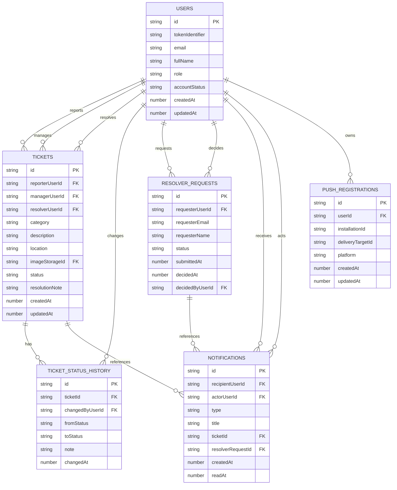

# CampusCare Database Schema

CampusCare stores application data in Convex tables defined in [convex/schema.ts](../convex/schema.ts). Convex also manages the internal `_storage` table used for uploaded ticket images.

## ERD



## Type Conventions

- `Id<"table">` fields are Convex document ids.
- `Id<"_storage">` fields reference Convex File Storage objects.
- Timestamps are Unix epoch milliseconds.
- Convex values cannot be `undefined`; nullable persisted fields use `null`.
- Optional fields may be absent on older records or records where the feature is not used.

## SQL Equivalent

This project uses Convex rather than SQL. The SQL below is an equivalent relational model for documentation purposes. Convex document ids and storage ids are represented as `TEXT`, arrays are represented as `JSONB`, and timestamps are represented as epoch milliseconds in `BIGINT` columns.

```sql
CREATE TABLE users (
  id TEXT PRIMARY KEY,
  token_identifier TEXT NOT NULL UNIQUE,
  email TEXT NOT NULL,
  full_name TEXT NOT NULL,
  role TEXT NOT NULL CHECK (role IN ('reporter', 'resolver', 'manager')),
  account_status TEXT NOT NULL CHECK (
    account_status IN (
      'active',
      'pending_resolver_approval',
      'resolver_rejected',
      'inactive'
    )
  ),
  created_at BIGINT NOT NULL,
  updated_at BIGINT NOT NULL,
  xp INTEGER,
  level INTEGER,
  closed_tickets_count INTEGER,
  badges JSONB
);

CREATE INDEX users_by_email
  ON users (email);

CREATE INDEX users_by_role_and_account_status
  ON users (role, account_status);

CREATE TABLE tickets (
  id TEXT PRIMARY KEY,
  reporter_user_id TEXT NOT NULL REFERENCES users(id),
  manager_user_id TEXT REFERENCES users(id),
  resolver_user_id TEXT REFERENCES users(id),
  category TEXT NOT NULL CHECK (char_length(category) <= 80),
  description TEXT NOT NULL CHECK (char_length(description) <= 1200),
  location TEXT NOT NULL CHECK (char_length(location) <= 140),
  image_storage_id TEXT NOT NULL,
  resolution_image_storage_id TEXT,
  status TEXT NOT NULL CHECK (
    status IN ('open', 'assigned', 'in_progress', 'resolved', 'closed')
  ),
  resolution_note TEXT CHECK (
    resolution_note IS NULL OR char_length(resolution_note) <= 1200
  ),
  created_at BIGINT NOT NULL,
  updated_at BIGINT NOT NULL,
  resolved_at BIGINT,
  closed_at BIGINT
);

CREATE INDEX tickets_by_reporter_user_id_and_created_at
  ON tickets (reporter_user_id, created_at);

CREATE INDEX tickets_by_image_storage_id
  ON tickets (image_storage_id);

CREATE INDEX tickets_by_resolution_image_storage_id
  ON tickets (resolution_image_storage_id);

CREATE INDEX tickets_by_status_and_created_at
  ON tickets (status, created_at);

CREATE INDEX tickets_by_status_and_resolver_user_id_and_created_at
  ON tickets (status, resolver_user_id, created_at);

CREATE INDEX tickets_by_status_and_updated_at
  ON tickets (status, updated_at);

CREATE INDEX tickets_by_updated_at
  ON tickets (updated_at);

CREATE INDEX tickets_by_resolver_user_id_and_updated_at
  ON tickets (resolver_user_id, updated_at);

CREATE TABLE ticket_status_history (
  id TEXT PRIMARY KEY,
  ticket_id TEXT NOT NULL REFERENCES tickets(id),
  changed_by_user_id TEXT NOT NULL REFERENCES users(id),
  from_status TEXT CHECK (
    from_status IS NULL
    OR from_status IN ('open', 'assigned', 'in_progress', 'resolved', 'closed')
  ),
  to_status TEXT NOT NULL CHECK (
    to_status IN ('open', 'assigned', 'in_progress', 'resolved', 'closed')
  ),
  note TEXT CHECK (note IS NULL OR char_length(note) <= 1200),
  changed_at BIGINT NOT NULL
);

CREATE INDEX ticket_status_history_by_ticket_id_and_changed_at
  ON ticket_status_history (ticket_id, changed_at);

CREATE INDEX ticket_status_history_by_changed_by_user_id_and_changed_at
  ON ticket_status_history (changed_by_user_id, changed_at);

CREATE TABLE resolver_requests (
  id TEXT PRIMARY KEY,
  requester_user_id TEXT NOT NULL REFERENCES users(id),
  requester_email TEXT NOT NULL,
  requester_name TEXT NOT NULL,
  reason TEXT,
  status TEXT NOT NULL CHECK (status IN ('pending', 'approved', 'rejected')),
  submitted_at BIGINT NOT NULL,
  decided_at BIGINT,
  decided_by_user_id TEXT REFERENCES users(id),
  decision_note TEXT
);

CREATE INDEX resolver_requests_by_requester_user_id
  ON resolver_requests (requester_user_id);

CREATE INDEX resolver_requests_by_status
  ON resolver_requests (status);

CREATE INDEX resolver_requests_by_submitted_at
  ON resolver_requests (submitted_at);

CREATE TABLE notifications (
  id TEXT PRIMARY KEY,
  recipient_user_id TEXT NOT NULL REFERENCES users(id),
  actor_user_id TEXT REFERENCES users(id),
  type TEXT NOT NULL CHECK (
    type IN (
      'ticket_created',
      'ticket_assigned',
      'ticket_in_progress',
      'ticket_resolved',
      'ticket_closed',
      'resolver_request_submitted',
      'resolver_request_approved',
      'resolver_request_rejected'
    )
  ),
  title TEXT NOT NULL,
  body TEXT NOT NULL,
  ticket_id TEXT REFERENCES tickets(id),
  resolver_request_id TEXT REFERENCES resolver_requests(id),
  dedupe_key TEXT,
  created_at BIGINT NOT NULL,
  read_at BIGINT
);

CREATE INDEX notifications_by_recipient_user_id_and_created_at
  ON notifications (recipient_user_id, created_at);

CREATE INDEX notifications_by_recipient_user_id_and_read_at
  ON notifications (recipient_user_id, read_at);

CREATE INDEX notifications_by_dedupe_key
  ON notifications (dedupe_key);

CREATE INDEX notifications_by_ticket_id_and_created_at
  ON notifications (ticket_id, created_at);

CREATE TABLE push_registrations (
  id TEXT PRIMARY KEY,
  user_id TEXT NOT NULL REFERENCES users(id),
  installation_id TEXT NOT NULL,
  delivery_target_id TEXT NOT NULL,
  platform TEXT NOT NULL CHECK (platform IN ('ios', 'android', 'web', 'unknown')),
  created_at BIGINT NOT NULL,
  updated_at BIGINT NOT NULL
);

CREATE INDEX push_registrations_by_installation_id
  ON push_registrations (installation_id);

CREATE INDEX push_registrations_by_user_id_and_updated_at
  ON push_registrations (user_id, updated_at);
```

## Enumerations

### `userRole`

| Value | Description |
| --- | --- |
| `reporter` | Submits and tracks own tickets. |
| `resolver` | Handles assigned tickets and can also submit tickets. |
| `manager` | Assigns, monitors, manages resolver access, and closes tickets. |

### `accountStatus`

| Value | Description |
| --- | --- |
| `active` | Account has access to role workflows. |
| `pending_resolver_approval` | User requested resolver access and is waiting for manager decision. |
| `resolver_rejected` | Resolver access was rejected by a manager. |
| `inactive` | Resolver account was deactivated by a manager. |

### `ticketStatus`

| Value | Description |
| --- | --- |
| `open` | Newly reported ticket. |
| `assigned` | Manager assigned a resolver. |
| `in_progress` | Resolver started work. |
| `resolved` | Resolver marked the ticket complete. |
| `closed` | Manager confirmed and closed the ticket. |

### `resolverRequestStatus`

| Value |
| --- |
| `pending` |
| `approved` |
| `rejected` |

### `notificationType`

| Value |
| --- |
| `ticket_created` |
| `ticket_assigned` |
| `ticket_in_progress` |
| `ticket_resolved` |
| `ticket_closed` |
| `resolver_request_submitted` |
| `resolver_request_approved` |
| `resolver_request_rejected` |

### `pushPlatform`

| Value |
| --- |
| `ios` |
| `android` |
| `web` |
| `unknown` |

## Table Definitions

### `users`

Stores one application user per Clerk token identifier.

| Field | Type | Required | Notes |
| --- | --- | --- | --- |
| `_id` | `Id<"users">` | Yes | Convex primary key. |
| `tokenIdentifier` | `string` | Yes | Clerk/Convex auth subject. Unique lookup target. |
| `email` | `string` | Yes | Normalized verified GIU email. |
| `fullName` | `string` | Yes | Display name from identity or email local part. |
| `role` | `reporter | resolver | manager` | Yes | Server-enforced authorization role. |
| `accountStatus` | Account status | Yes | Controls protected access. |
| `createdAt` | `number` | Yes | Epoch milliseconds. |
| `updatedAt` | `number` | Yes | Epoch milliseconds. |
| `xp` | `number` | No | Reporter reward points. |
| `level` | `number` | No | Reporter reward level. |
| `closedTicketsCount` | `number` | No | Number of reporter tickets closed. |
| `badges` | `gamificationBadge[]` | No | Earned badge identifiers. |

Indexes:

| Index | Fields | Purpose |
| --- | --- | --- |
| `by_tokenIdentifier` | `tokenIdentifier` | Find current user from Clerk identity. |
| `by_email` | `email` | Find users by normalized email. |
| `by_role_and_accountStatus` | `role`, `accountStatus` | Manager directories and active resolver lists. |

### `tickets`

Stores facility issue tickets and their current lifecycle state.

| Field | Type | Required | Notes |
| --- | --- | --- | --- |
| `_id` | `Id<"tickets">` | Yes | Convex primary key. |
| `reporterUserId` | `Id<"users">` | Yes | User who submitted the ticket. |
| `managerUserId` | `Id<"users"> | null` | Yes | Manager who assigned or closed the ticket. |
| `resolverUserId` | `Id<"users"> | null` | Yes | Assigned resolver. |
| `category` | `string` | Yes | Trimmed, max 80 chars. |
| `description` | `string` | Yes | Trimmed, max 1200 chars. |
| `location` | `string` | Yes | Trimmed, max 140 chars. |
| `imageStorageId` | `Id<"_storage">` | Yes | Required reporter image. |
| `resolutionImageStorageId` | `Id<"_storage"> | null` | No | Optional resolver completion image. |
| `status` | Ticket status | Yes | Current lifecycle status. |
| `resolutionNote` | `string | null` | Yes | Required when status becomes `resolved`. |
| `createdAt` | `number` | Yes | Epoch milliseconds. |
| `updatedAt` | `number` | Yes | Epoch milliseconds. |
| `resolvedAt` | `number | null` | Yes | Set when resolver resolves. |
| `closedAt` | `number | null` | Yes | Set when manager closes. |

Indexes:

| Index | Fields | Purpose |
| --- | --- | --- |
| `by_reporterUserId_and_createdAt` | `reporterUserId`, `createdAt` | Reporter ticket history. |
| `by_imageStorageId` | `imageStorageId` | Check whether an upload is referenced. |
| `by_resolutionImageStorageId` | `resolutionImageStorageId` | Check whether a resolution upload is referenced. |
| `by_status_and_createdAt` | `status`, `createdAt` | Status-based listing by creation time. |
| `by_status_and_resolverUserId_and_createdAt` | `status`, `resolverUserId`, `createdAt` | Manager open queue and resolver active-ticket checks. |
| `by_status_and_updatedAt` | `status`, `updatedAt` | Manager monitor and counts. |
| `by_updatedAt` | `updatedAt` | Manager all-ticket monitor. |
| `by_resolverUserId_and_updatedAt` | `resolverUserId`, `updatedAt` | Resolver assigned queue. |

### `ticket_status_history`

Append-only audit trail for ticket lifecycle changes.

| Field | Type | Required | Notes |
| --- | --- | --- | --- |
| `_id` | `Id<"ticket_status_history">` | Yes | Convex primary key. |
| `ticketId` | `Id<"tickets">` | Yes | Ticket being changed. |
| `changedByUserId` | `Id<"users">` | Yes | Actor who caused the change. |
| `fromStatus` | Ticket status or `null` | Yes | `null` for initial creation. |
| `toStatus` | Ticket status | Yes | New status. |
| `note` | `string | null` | Yes | Optional manager/resolver note. |
| `changedAt` | `number` | Yes | Epoch milliseconds. |

Indexes:

| Index | Fields | Purpose |
| --- | --- | --- |
| `by_ticketId_and_changedAt` | `ticketId`, `changedAt` | Ticket detail timeline. |
| `by_changedByUserId_and_changedAt` | `changedByUserId`, `changedAt` | Actor audit queries. |

### `resolver_requests`

Tracks requests from users who want resolver access.

| Field | Type | Required | Notes |
| --- | --- | --- | --- |
| `_id` | `Id<"resolver_requests">` | Yes | Convex primary key. |
| `requesterUserId` | `Id<"users">` | Yes | User requesting resolver access. |
| `requesterEmail` | `string` | Yes | Email snapshot at submission. |
| `requesterName` | `string` | Yes | Name snapshot at submission. |
| `reason` | `string | null` | Yes | Optional requester reason. |
| `status` | Resolver request status | Yes | Current request decision state. |
| `submittedAt` | `number` | Yes | Epoch milliseconds. |
| `decidedAt` | `number | null` | Yes | Set when approved/rejected. |
| `decidedByUserId` | `Id<"users"> | null` | Yes | Manager who decided. |
| `decisionNote` | `string | null` | Yes | Required on rejection, null on approval. |

Indexes:

| Index | Fields | Purpose |
| --- | --- | --- |
| `by_requesterUserId` | `requesterUserId` | Find latest request for a user. |
| `by_status` | `status` | Manager pending approvals list. |
| `by_submittedAt` | `submittedAt` | Submission ordering. |

### `notifications`

Stores in-app notification records.

| Field | Type | Required | Notes |
| --- | --- | --- | --- |
| `_id` | `Id<"notifications">` | Yes | Convex primary key. |
| `recipientUserId` | `Id<"users">` | Yes | User receiving the notification. |
| `actorUserId` | `Id<"users"> | null` | Yes | User who caused the event, if applicable. |
| `type` | Notification type | Yes | Domain event category. |
| `title` | `string` | Yes | Notification title. |
| `body` | `string` | Yes | Notification message body. |
| `ticketId` | `Id<"tickets"> | null` | Yes | Related ticket, if applicable. |
| `resolverRequestId` | `Id<"resolver_requests"> | null` | Yes | Related resolver request, if applicable. |
| `dedupeKey` | `string | null` | Yes | Prevents duplicate notification creation. |
| `createdAt` | `number` | Yes | Epoch milliseconds. |
| `readAt` | `number | null` | Yes | Null until read. |

Indexes:

| Index | Fields | Purpose |
| --- | --- | --- |
| `by_recipientUserId_and_createdAt` | `recipientUserId`, `createdAt` | Notification center list. |
| `by_recipientUserId_and_readAt` | `recipientUserId`, `readAt` | Unread counts and mark-all-read. |
| `by_dedupeKey` | `dedupeKey` | Idempotent notification creation. |
| `by_ticketId_and_createdAt` | `ticketId`, `createdAt` | Ticket-related notifications. |

### `push_registrations`

Stores Expo push delivery targets per app installation.

| Field | Type | Required | Notes |
| --- | --- | --- | --- |
| `_id` | `Id<"push_registrations">` | Yes | Convex primary key. |
| `userId` | `Id<"users">` | Yes | Owning user. |
| `installationId` | `string` | Yes | App installation identifier. |
| `deliveryTargetId` | `string` | Yes | Expo push token or delivery target id. |
| `platform` | Push platform | Yes | `ios`, `android`, `web`, or `unknown`. |
| `createdAt` | `number` | Yes | Epoch milliseconds. |
| `updatedAt` | `number` | Yes | Epoch milliseconds. |

Indexes:

| Index | Fields | Purpose |
| --- | --- | --- |
| `by_installationId` | `installationId` | Upsert/remove one installation. |
| `by_userId_and_updatedAt` | `userId`, `updatedAt` | List or remove a user's push registrations. |

## Integrity Rules

- Users are looked up by `tokenIdentifier`; client-provided roles are never trusted.
- Ticket status history is append-only through `appendTicketStatusHistory`.
- Reporter ticket creation inserts a matching initial `ticket_status_history` row.
- Managers can assign only active resolver users.
- Resolvers can update only tickets assigned to their own user id.
- `resolved` requires a non-empty resolution note.
- Manager closure is the only transition from `resolved` to `closed`.
- Upload cleanup refuses to delete storage objects referenced by any ticket field.
